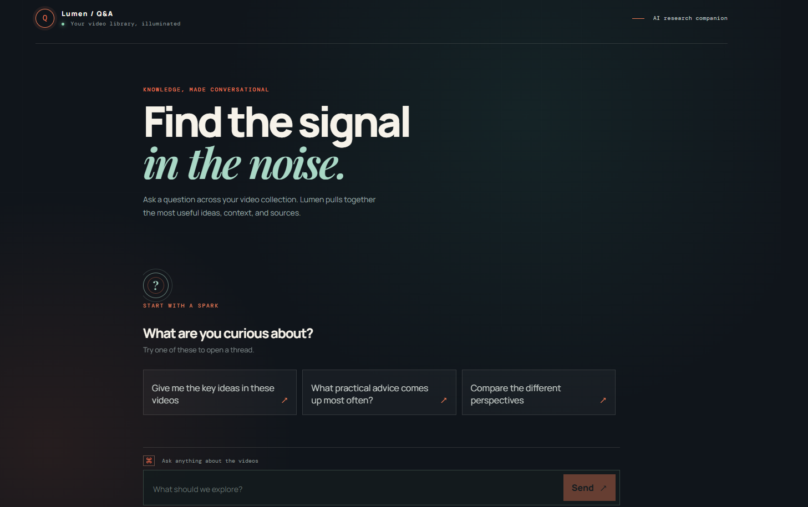
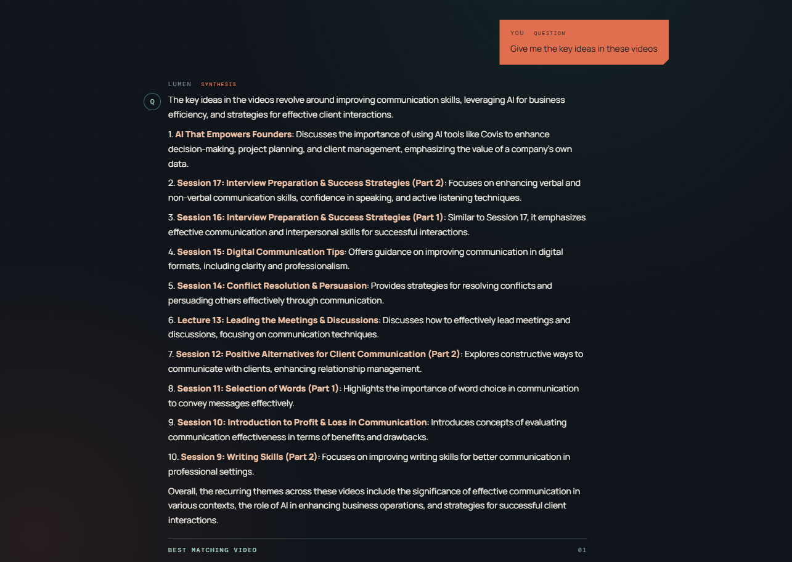
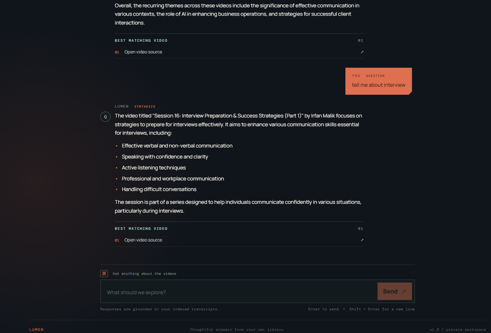
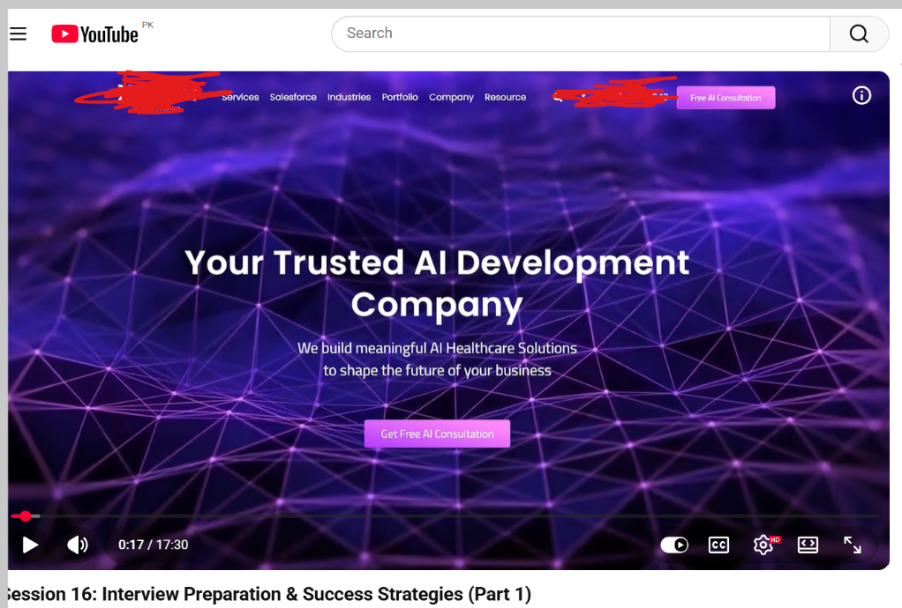

# 🎬 YouTube Q&A Chatbot

An AI-powered chatbot that answers questions from **10 YouTube videos** and provides **source links** to the exact video where the answer was found.

---

## 🚀 Features

- 🎥 **Ingests 10 YouTube videos** automatically
- 🧠 **Semantic search** using Pinecone vector database
- 🤖 **GPT-4o-mini** for accurate, context‑based answers
- 🔗 **Source attribution** – shows the video link for every answer
- 🌍 **Multilingual support** – understands Hindi/Urdu transcripts and answers in English
- ⚡ **FastAPI backend** + **React frontend** (TypeScript + Tailwind)

---

## 📸 Screenshots

### 1. Chat Interface
Clean, modern interface for asking questions.

### 2. Answer with Source
The bot answers accurately and provides the source video link.

### 2. Answer with Source
The bot answers accurately and provides the source video link.

### 2. open  Source
The bot answers accurately and provides the source video link.

---

## 🛠️ Tech Stack

| Component       | Technology |
|----------------|------------|
| **Backend**    | FastAPI, Python |
| **LLM**        | OpenAI GPT-4o-mini |
| **Vector DB**  | Pinecone |
| **Embeddings** | text-embedding-3-small |
| **Frontend**   | React, TypeScript, Vite, Tailwind CSS |
| **Transcripts**| youtube-transcript-api |

---

## 📁 Project Structure
